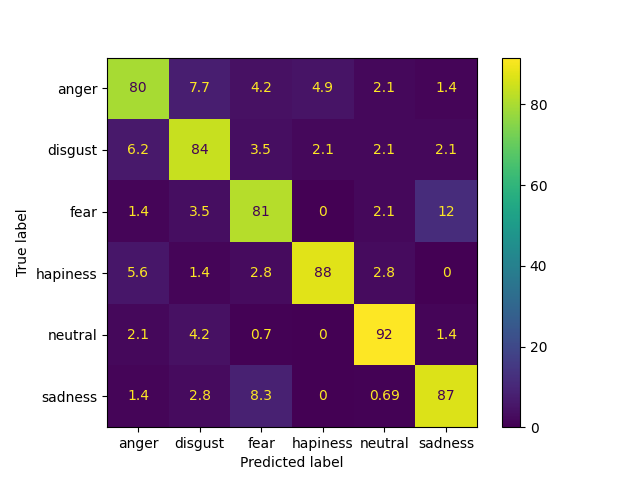

# Speech emotion recognition with deep convolutional neural networks in various languages
## Introduction
Complete code for a Python Speech Emotion Recognition model using CNN's, tested with the RAVDESS (Ryerson Audio-Visual Database of Emotional Speech and Song),
CaFE (Canadian French Emotional) and MESD (Mexican Emotional Speech Database) datasets.  
Todo: Increasing the current precision for RAVDESS dataset to 80-90%, if new literature has upgrades to accuracy using CNN's.  
Todo: Increasing the current precision for CAFE dataset.  
Links to the datasets: [RAVDESS](https://www.kaggle.com/datasets/uwrfkaggler/ravdess-emotional-speech-audio), [CaFE](https://zenodo.org/records/1478765), [MESD](https://www.kaggle.com/datasets/saurabhshahane/mexican-emotional-speech-database-mesd)  
## Description of the model
The speech_recognition.py file consists of three main parts:  
1. Feature extraction (using dataframe_generators.py file).
2. Creating the CNN model.
3. Training the model, and obtaining the average accuracy of all folds.

## Setup
In a Linux terminal, run the following command:  
```
python3 speech_recognition.py
```

## Results 
Confusion Matrix for RAVDESS dataset:  
  

Score per fold for RAVDESS dataset:  
  

Confusion Matrix for CaFE dataset:  
  

Score per fold for CaFE dataset:  
  

Confusion Matrix for MESD dataset:  
  

Score per fold for MESD dataset:  
  

## Authors
Code by [Derek Suárez](https://github.com/antipixel1).  
Current CNN model is based on the [article](https://www.sciencedirect.com/science/article/abs/pii/S1746809420300501) from D Issa, MF Demirci and A Yazici.  

## References 
Issa, D., Demirci, M. F., Yazici, A. (2020). Speech emotion recognition with deep convolutional neural networks. Biomedical Signal Processing and Control 59, 1-11. https://www.sciencedirect.com/science/article/abs/pii/S1746809420300501
